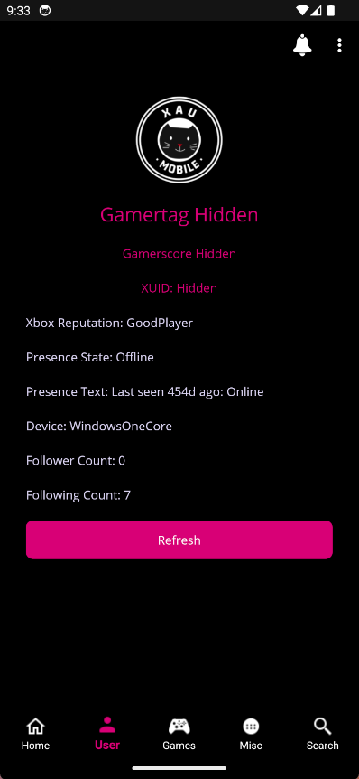
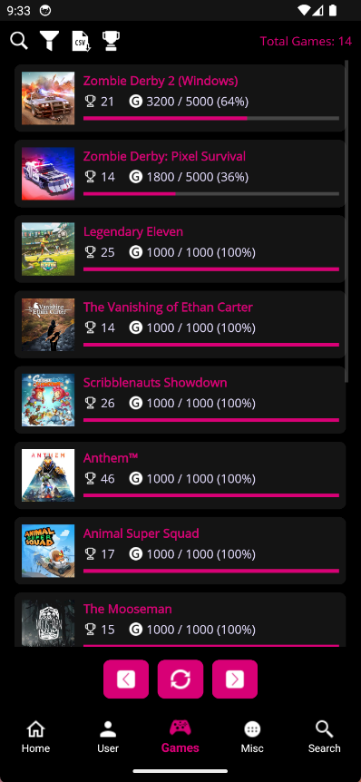
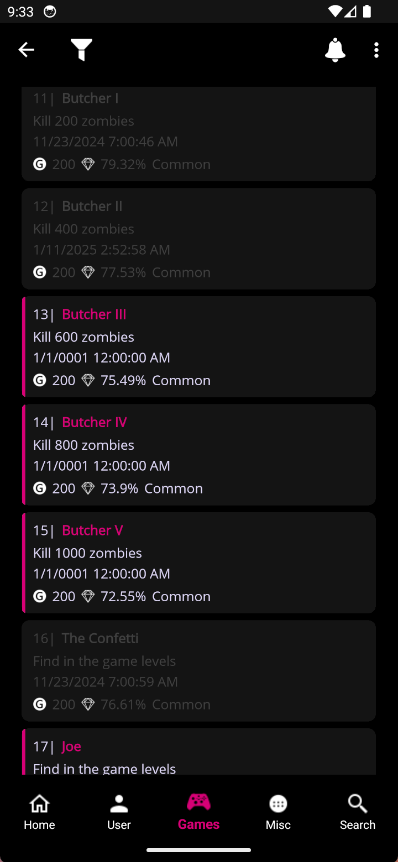

# XAU Mobile Archive

**This is an archived repository - no further updates will be made to this code.**

XAU Mobile is a mobile version of the Xbox Achievement Unlocker, providing comprehensive functionality for viewing and managing Xbox games and achievements on Android devices.
The application enables users to view account games, browse other users' game libraries, view achievement details, unlock achievements for titles, edit stats, spoof titles, perform game searches, and much more!

## Screenshots

  
  
  

## Download

For the latest release and downloads, visit the main release repository: [[https://github.com/MrAAA162/XAUMobile-Release](https://github.com/MrAAA162/XAUMobile-Release/releases)]

## Technical Details

- **Framework**: [.NET MAUI](https://dotnet.microsoft.com/en-us/apps/maui)
- **Language**: C#
- **Target Framework**: .NET 8
- **Platform**: Android

## Building from Source

To build your own APK from this source code:

1. Ensure you have the .NET MAUI workload installed
2. Download all required NuGet packages
3. Follow Microsoft's official guide for publishing Android apps: [Publish a .NET MAUI app for Android](https://learn.microsoft.com/en-us/dotnet/maui/android/deployment/publish-ad-hoc?view=net-maui-8.0)

## Credits

Original concept and PC version by the [Xbox Achievement Unlocker](https://github.com/Fumo-Unlockers/Xbox-Achievement-Unlocker) team.

Mobile implementation by [me](https://github.com/MrAAA162).

## License

This project is licensed under the Apache License 2.0 - see the [LICENSE](LICENSE) file for details.

## Archive Notice

This repository serves as a historical archive of the XAU Mobile source code. For active development news on XAU Mobile V3, support, and additional information, join the Discord: https://discord.gg/qRkTgnUMFt
